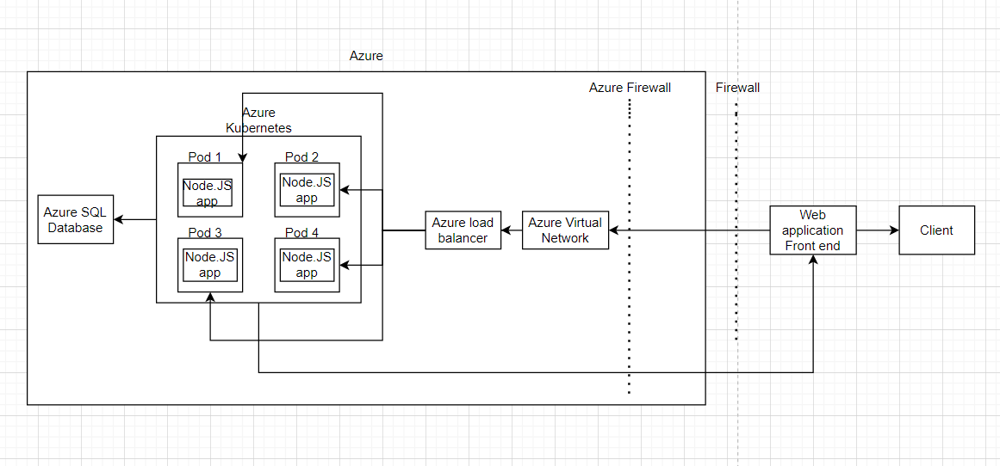

1. A solution diagram showing the target architecture with Kubernetes pods and a managed database.

2. A description of the target architecture, emphasizing the use of container orchestration for scalability and high availability.
There are many components in this design. First there is a client interacting with a web application front end behind a firewall, which routes traffic through an Azure Firewall. The traffic is directed to an Azure Virtual Network, then balanced by an Azure Load Balancer that distributes requests to Azure Kubernetes. The Azure Kubernetes has distributed Node.js applications within pods inside it. Data is stored in an Azure SQL Database. With this design the AKS ensures scalability and high availability by distributing workloads across multiple pods.

1. The steps of migration

Containerization of the web application.
-Convert the existing web application into Docker containers.
-Define container images.
-Ensure proper configuration for Node.js runtime.
-Store the container images in a container registry.

Migration of the database to a managed SQL service.
-Install all dependencies of the database on Azure.
-Migrate to Azure SQL Database.

Configuration of the Kubernetes cluster for high availability.
-Deploy the AKS on Azure.
-Configure the pods settings.
-Deploy the NodeJS application to the pods.
-Enable autoscaling with Azure load balancers.
