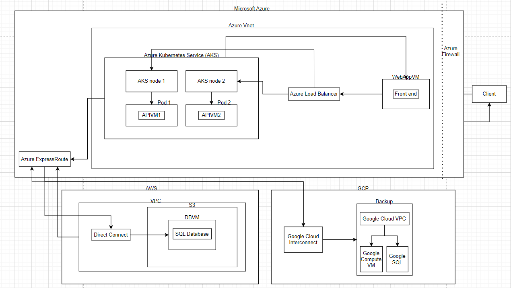

A detailed solution diagram showing the cloud-native target architecture (e.g., load balancers, managed databases, autoscaling groups)

- **Client**: The user accessing the web.
- **Azure Firewall**: Filter traffic between services.
- **Frontend VM**: Hosts the web application for the frontend.
- **Load Balancer**: Distributes traffic across the front-end and AKS pods.
- **VNet**: Virtual network in Azure, connecting all resources.
- **AKS**: Azure Kubernetes Service, running containerized applications.
- **AKS Node**: VM in Azure. 
- **AKS Pod** runs the backend service inside the node.
- **Azure ExpressRoute**: Connection between Azure and AWS/GCP.
- **AWS VPC**: Isolated virtual network in AWS for resources.
- **AWS Direct Connect**: Private connection between AWS and Azure.
- **AWS S3**: Scalable object storage service in AWS.
- **AWS SQL Database**: database hosted in AWS.
- **Google Cloud Interconnect**: Private, low-latency connection between Google Cloud and Azure.
- **Google Cloud VPC**: Virtual private network for GCP resources.
- **Google Cloud VM**: Virtual machine in GCP.
- **Google Cloud SQL**: SQL database service in GCP.

A description of how the target architecture addresses scalability, availability, and disaster recovery

- **Scalability**: 
  - Azure Kubernetes Service (AKS) auto-scales pods and nodes to handle traffic spikes.
  - AWS S3 and GCP VMs provide scalable storage and compute power.

- **Availability**: 
  - Azure Load Balancer ensures traffic distribution across healthy services.
  - AWS and GCP have replicated databases and VMs for failover in case of downtime.

- **Disaster Recovery**: 
  - Azure ExpressRoute, AWS Direct Connect, and Google Cloud Interconnect enable multi-cloud connectivity for rapid failover between Azure, AWS, and GCP environments.

A step-by-step breakdown of the migration process, including necessary considerations such as data migration, testing, and rollback strategies

1. **Assess and Plan**: Identify dependencies between Azure, AWS, and GCP services.
2. **Data Migration**: Use Azure Data Factory to replicate Azure SQL to AWS and GCP SQL databases.
3. **App Containerization**: Migrate the backend VM to AKS pods, ensuring compatibility.
4. **Testing**: Simulate failovers from Azure to AWS and GCP to validate the disaster recovery (DR) strategy.
5. **Network Configuration**: Set up ExpressRoute, Direct Connect, and Interconnect to connect Azure with AWS and GCP.
6. **Rollback Plan**: Implement automated backups and create scripts to revert to the last stable state.
